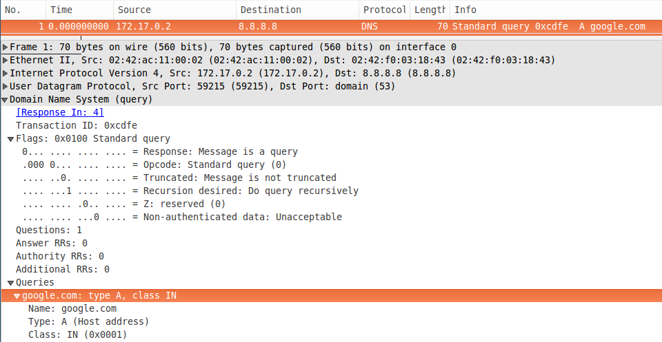
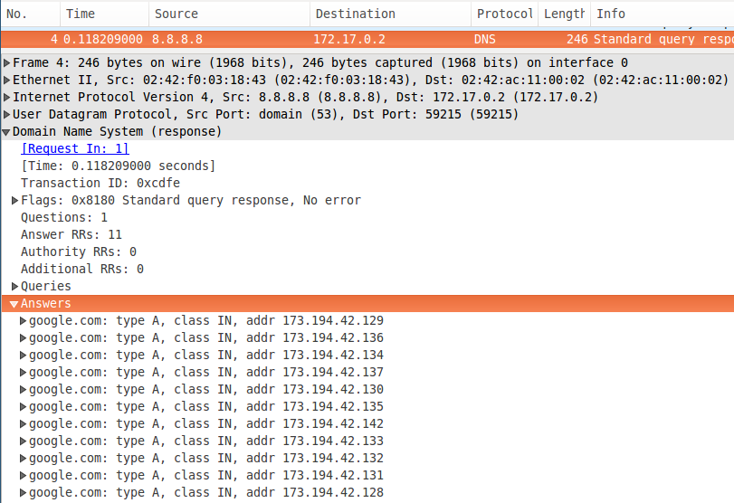

# netsim

> Network Simulator

<!-- START doctoc generated TOC please keep comment here to allow auto update -->
<!-- DON'T EDIT THIS SECTION, INSTEAD RE-RUN doctoc TO UPDATE -->
**Table of Contents** 

- [Protocols](#protocols)
- [Inside](#inside)
  - [packets](#packets)
    - [IP datagram](#ip-datagram)
    - [UDP segment](#udp-segment)
    - [TCP segment](#tcp-segment)
    - [IRC message](#irc-message)
    - [DNS message](#dns-message)
  - [System](#system)
    - [`host_t`](#host_t)
    - [`router_t`](#router_t)
    - [`link_t`](#link_t)
    - [`interface_t`](#interface_t)
    - [`addr_t`](#addr_t)
    - [`ft_t`](#ft_t)
    - [`event_t`](#event_t)
    - [`sniffer_t`](#sniffer_t)
    - [Forwarding](#forwarding)
- [Usage](#usage)
  - [Commands](#commands)
  - [Example Trace](#example-trace)
- [API](#api)
- [Output](#output)
  - [IP](#ip)
  - [TCP](#tcp)
  - [UDP](#udp)
  - [DNS](#dns)
  - [IRC](#irc)
- [More](#more)
  - [IP packet](#ip-packet)
  - [Naive DNS Resolution](#naive-dns-resolution)

<!-- END doctoc generated TOC please keep comment here to allow auto update -->

## Protocols

- Network: IP
- Transport: UDP and TCP
- Application: IRC and DNS

## Inside

### packets

When specifying segment/datagram fields we can take advantage of c99's bit fields these things won't really get out to the netword, thus we'll not have problems with endiannes and other complications that building with different compilers might arise.

> IP (network layer) provides logical communication between hosts.
> TCP & UDP (transport layer) provides logical communication between processes.

#### IP datagram

```c
struct ip_t {
  const uint32_t version:4 = 4;           //  -+-
  const uint32_t header_length:4 = 20;    //   |  32
  const uint32_t tos:8 = 0;               //   | bits
  uint32_t datagram_length:16 = 0;        //  -+-

  uint32_t id:16;                   
  const uint32_t flags:3 = 0;
  const uint32_t frag_offset:13 = 0;

  uint32_t ttl:8;           
  uint32_t upper_layer_protocol:8;
  uint32_t checksum:16;

  uint32_t ttl:8;           
  uint32_t upper_layer_protocol:8;
  uint32_t checksum:16;

  uint32_t src_ip_addr;
  uint32_t dst_ip_addr;
  void* payload;
};

// provide a const static "intial_state" packet template.
```

Having 16bits for datagram length, each datagram has a max of 2^16B but that's not reached under normal circunstances (generally ~1500B for each). The link-layer places the hard limit (MTU - maximum transfer unit) on the length of a datagram. There's also another limit, from a layer above (the transport layer), that might cap this: the MSS (Maximum Segment Size - generally set to the same value as MTU), set by TCP (remember that UDP don't have this).

We can assume that there'll be no fragmentation at network layer as our DNS queries (the only part of the system where UDP is used) won't be larger than 1500B, thus, fragmentation issues will be held all at the transport layer.

#### UDP segment

```c
struct udp_t {
  src port;
  dest port;
  uint8_t* payload;
};
```

#### TCP segment

```c
struct tcp_t {
  src port;
  dest port;

  uint8_t* payload;
};
```

#### IRC message

```c
struct irc_t {

};
```

#### DNS message

```c
struct dns_t {

};
```

### System
IP mask: `255.255.255.0` (0xffffff00)

#### `host_t`

```c
enum app_e {
  IRCC,
  IRCS,
  DNSS
};

struct host_t { 
  char name[NS_NAME_MAX];
  interface_t interface;
  addr_t router_addr;
  addr_t dns_addr;
  app_e app;
};
```

#### `router_t`

The router's job will be simply to receive a datagram on one link and forward the datagram on some other link.

```c
struct router_t { 
  char name[NS_NAME_MAX];
  interface_t** interfaces;
  uint8_t interfaces_count;
  uint16_t processing_time;   // in us

  ft_t* forwarding_table;
};
```

#### `link_t`

A link represents a connection between two interfaces. As the simulator only cares about duplex links, `link_t` has two buffers.

It is a resource that's shared between two interfaces but only between these two.

One of the buffers is always acquired by a single interface as its write stream. Each buffer is identified by an ID, which is what the interface grabs when trying the `acquire()` the shared resource (and thus, have the permission to write). The process of acquiring one of the link's ends corresponds to the process of 'becoming a producer' in a 'consumer-producer' paradigm.


```c
struct link_t {
  uint16_t latency;           // ms
  uint8_t band;               // Mbps
  ip_t* buffer[2];

                                  // sniffer struct provides a
  sniffer* sniffing_function;     // function to call when actions
                                  // occur on this link so that we
                                  // can log them when a sniffer 
                                  // attaches.
}
```

#### `interface_t` 

An IP address is technically associated with an interface, rather than with the host or router containing that interface.

```c
struct interface_t { 
  addr_t addr;
  link_t* link;
  queue_t* packets_queue;
};
```

#### `addr_t`

Address. Encompasses presentation and numeric form.

```
struct addr_t {
  char p_ip[16];              // presentation ip (255.255.255.255)
  uint32_t n_ip;              // numeric ip      (   0xffffffff  )
};
```

#### `ft_t`

Router's Forwarding Table

```c
struct ft_t {
  TODO 
};
```

#### `event_t`

Event that gets into the system (a client performs):

```c
struct event_t {
  uint32_t ms;
  host_t* host;
  char command[NS_COMMAND_SIZE];
};
```

#### `sniffer_t`

```c
struct sniffer_t {
  FILE* log_file;
  link_t* link;

  sniffer_func* sniffing_function;
};
```

#### Forwarding

```
(iforwarding_table, addr) => interface

ip_mask : interface   -+-
ip_mask : interface    |
ip_mask : interface    |  forwarding to router interfaces by masking.
ip_mask : interface    |
ip_mask : interface   -+-

ip: router address ==> interface  -+-
ip: router address ==> interface   |  out-the-network forwarding.
ip: router address ==> interface   |  given the router addr we know the interface to
ip: router address ==> interface   |  send the packet to.
ip: router address ==> interface  -+-

  (ps.: at parsing time we're capable of resolving ip router `(address => interface)`
        and so we only really need an interface forwading table
```

We know that prefix size will always be 24b (as we're dealing with class C addresses). So, every prefix matching will take form of:

```c
if (MASK & (addr.n_ip >> 8)) {
  // do something
}
```

The forwarding table is given per-router (and so, it's not shared and different for each of them). They are constructed at parsing time.

## Usage

### Commands

``` 
- host <hname>
- router <rname> <# interfaces>
- duplex-link <hname | rname.int> <hname | router.int> <band> <latency>
- ip (<hname> <host_ip> <router_ip> <dns_server_ip> ) |
     (<hname> <interface> <ip> [[<interface> <ip>] ...] )
- route <rname> [[<ip> <interface>] ... ] <ip> [[<ip> ...] <interface>
- performance <rname> <packet_process_time> [[<interface> <bufsize>] ...]
- (ircc|ircs|dnss) <hname> <app_name>
- sniffer <hname | rname.int>  <hname | rname.int> "<file_name>"
- simulate <timestamp> <name> "<command>"
``` 

### Example Trace

```
# Creation of 4 hosts, each having a single interface

set host h0
set host h1
set host h2
set host h3


# Creation of 2 routers with 3 interfaces each

set router r0 3
set router r1 3

# link creation
#
#  (10.0.0.1)                
#      h0 -------(10.0.0.2)---.             
#                           (0)\          
#                               r0(2)--(192.168.3.3)
#                           (1)/            
#      h1 -------(10.1.1.2)---´             
#  (10.1.1.1)          
#
#
# 
#                                           (192.168.2.2)
#                      .-----(192.168.2.3) ----- h2
#                     /(1)
# (192.168.3.4)--(0)r1
#                     \(2)
#                      `-----(192.168.1.2) ----- h3
#                                           (192.168.1.1)

# set duplex-link device router.port bandwidth latency

set duplex-link h0 r0.0 10Mbps 10ms
set duplex-link h1 r0.1 5Mbps 2ms
set duplex-link r0.2 r1.0 5Mbps 2ms
set duplex-link r1.1 h2 2Mbps 20ms
set duplex-link r1.2 h3 5Mbps 2ms

# hosts configuration
# set ip <name> <host_ip> <router_ip> <dns_server_ip>
set ip h0 10.0.0.1      10.0.0.2    192.168.1.1
set ip h1 10.1.1.1      10.0.0.2    192.168.1.1
set ip h2 192.168.2.2   198.168.2.3 192.168.1.1

# 1.1.1.1 corresponds to the root DNS server that all
# servers need to be configured for as their root DNS 
# server.
set ip h3 192.168.1.1   198.168.2.3 1.1.1.1

# router configuration
# set ip <r_name> port, ip [[port, ip] ... ]
set ip r0 0 10.0.0.2        1 10.1.1.2      2 192.168.3.3
set ip r1 0 192.168.3.4     1 192.168.2.3   2 192.168.1.2

# routing configuration
# note: all networks are Class-C
set route r0 10.0.0.0 0 10.1.1.0 1 192.168.3.0 2 \
             192.168.2.0 192.168.3.4 192.168.1.0 192.168.3.4
set route r1 192.168.3.0 0 192.168.2.0 1 192.168.1.0 2 
             10.0.0.0 192.168.3.3 10.1.1.0 192.168.3.3

# routers processing time configuration
# <name> <time_to_process a packet> [[<port> <bufsize> ] ... ]
set performance r0 100us 0 1000 1 1000 2 1000
set performance r1 20us 0 1000 1 1000 2 1000

# Application Specification
set ircc h0 irc1
set ircc h1 irc2
set ircs h2 irc3
set dnss h3 dns1

# sniffer configuration
set sniffer r0.2 r1.0 "/tmp/sniffer1"
set sniffer h1 r0.1 "/tmp/sniffer2"

simulate 0.5 irc1 "CONNECT h2 6667"
simulate 0.6 irc2 "CONNECT 192.168.2.2 6667"
simulate 2.0 irc1 "USER usuario1"
simulate 4.0 irc2 "USER usuario2"
simulate 4.1 irc1 "QUIT"
simulate 5.0 irc2 "QUIT"
finish 5.0
```

## API

Hosts provide the toplevel API freeing the user from having to deal with segments and datagrams. They just need to care about well formed application-level messages.

```c
int host_send(host_t* host, addr_t* dest_address,
              buffer_t* message);
```


## Output

- packet identifier
- timestamp 
- sniffer identification

### IP

- source IP
- destination IP
- identification of upper layer protocol (following RFC spec)
- IP header size + payload size
- TTL

### TCP

- source port
- destination port
- sequency number
- acklowledgement number (in case ACK is up)
- ACK bit
- FIN bit
- SYN bit

- Consider that the MSS is always equal to 1460 bytes.
- There's no need to implement congestion control and control flow mechanisms.

### UDP

- source port
- destination port
- UDP header size + payload from upper layer

### DNS

Just needs to return an IP address for a given name passed to it.

### IRC

- CONNECT
- USER
- QUIT

## More

### IP packet


### Naive DNS Resolution

This simulator simply simulates a direct query to a server capable of resolving all requests on its own. Inespecting a real query we can grasp the packets and have a look at how that works:

```
$ cat /etc/resolv.conf
# Dynamic resolv.conf(5) file for glibc resolver(3) generated by resolvconf(8)
#     DO NOT EDIT THIS FILE BY HAND -- YOUR CHANGES WILL BE OVERWRITTEN
search Home

nameserver 8.8.8.8
nameserver 8.8.4.4
```

**Query**



**Response**



In our case, DNS queries will be made for hostnames like "h0, h1 ..." defined with `set (ircc|ircs|dnss) <host> <hostname>` against a server configured as `dnss` (dns server) whose IP address is known in advance by all hosts during parse time.

There are no explicit DNS requests. They all occur implicitly in commands like `simulate 0.5 irc1 "CONNECT h2 6667`. We assume that there's no cache in those machines (i.e, DNS queries have to made all the time when a hostname is specified instead of an IP address).

